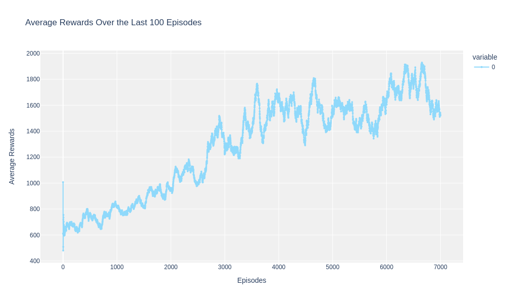

# Super Mario with Deep Q-Learning


This project demonstrates how to train an AI agent to play Super Mario using Deep Q-Learning (DQL). DQL combines Q-learning with deep neural networks, allowing the agent to learn to play complex games from raw pixel data.

## Overview

The notebook includes:

- **Environment Preprocessing**: Applies wrappers for frame skipping, resizing, grayscale conversion, normalization, and frame stacking.
- **Convolutional Neural Network (CNN) Model**: A neural network to process game frames and extract features for decision-making.
- **DQN Agent**: Interacts with the environment, learns optimal actions using experience replay, and periodically updates a target network to stabilize learning.

## Installation

Ensure you have the following packages installed:

```bash
pip install gym-super-mario-bros==7.4.0
pip install gym==0.26.2
pip install nes-py==8.2.1
pip install tensordict
pip install torchrl
pip install gym[other]
```

## Usage

### Training

You can train the agent by running the following code in the Jupyter notebook:

```python
history = train(agent, env, num_episodes=7000, ckpt_save_interval=500, log=True)
```

### Testing

To test the trained agent, use:

```python
test('model_mario_6500.pt', num_episodes=1, epsilon=0.02)
```

### Video

Watch a video of the agent playing Super Mario:


## Results

The training progress and average rewards over episodes are plotted using Plotly:

- **Average Rewards**: A line graph showing average rewards over the last 100 episodes.




## Key Components

- **Wrappers**: Used for efficient frame processing and environment interaction.
- **CNN Model**: Extracts features from game frames for decision-making.
- **DQN Agent**: Implements learning and decision-making using a neural network and experience replay.

## References

- [Deep Q-Learning](https://blog.damavis.com/aprendizaje-por-refuerzo-profundo-dqn/)

